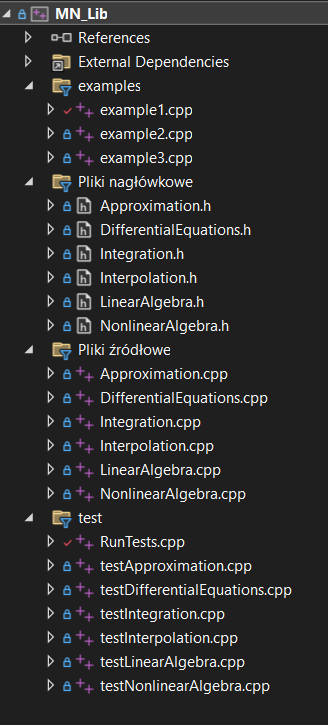

# Biblioteka Numeryczna

## Opis projektu

Niniejszy projekt stanowi implementację biblioteki numerycznej stworzonej w ramach Laboratorium 13 z przedmiotu *Metody Numeryczne*. Biblioteka zawiera zestaw podstawowych metod obliczeniowych poznanych podczas zajęć. Głównym celem projektu jest rozwój praktycznych umiejętności w zakresie programowania, testowania, dokumentowania i organizowania kodu źródłowego.

## Zakres funkcjonalny

Biblioteka implementuje funkcje z następujących obszarów numerycznych:

- **Rozwiązywanie układów równań liniowych**: metoda eliminacji Gaussa, rozkład LU
- **Interpolacja**: interpolacja Lagrange’a, Newtona
- **Aproksymacja**: metoda najmniejszych kwadratów
- **Całkowanie numeryczne**: metoda prostokątów, trapezów, Simpsona
- **Rozwiązywanie równań różniczkowych**: metoda Eulera, metoda Rungego-Kutty 4. rzędu
- **Rozwiązywanie równań nieliniowych**: metoda bisekcji, metoda Newtona

## Struktura katalogów
numerical_lib/  
├── include/ # Pliki nagłówkowe (.h)  
├── src/ # Pliki źródłowe (.c / *.cpp)  
├── tests/ # Testy jednostkowe  
├── examples/ # Przykłady użycia  
└── README.md # Dokumentacja projektu  

## Kompilacja

1.	Otwórz rozwiązanie w Visual Studio 2022
Otwórz plik .sln znajdujący się w katalogu głównym projektu lub przejdź do katalogu z projektem i otwórz plik .vcxproj.
2.	Wybierz konfigurację
Wybierz odpowiednią konfigurację kompilacji (np. Debug lub Release) oraz platformę (x64 lub Win32) w górnym pasku Visual Studio.
3.	Zbuduj rozwiązanie
Wciśnij Ctrl+Shift+B lub wybierz z menu Build > Build Solution.
4.	Uruchom testy lub przykładowy program
Po poprawnej kompilacji uruchom wybrany projekt (np. testy jednostkowe lub przykłady) za pomocą F5 (Debug) lub Ctrl+F5 (bez debugowania).
Wymagania:
•	Visual Studio 2022
•	Kompilator zgodny z C++14

## Instalacja
Bibliotekę można zainstalować lokalnie kopiując odpowiednie pliki nagłówkowe i zbudowaną bibliotekę statyczną lub dynamiczną do katalogu projektu docelowego. Można ją też dodać jako submoduł do innego repozytorium Git.

## Dokumentacja
- Każda funkcja w bibliotece zawiera:
- Opis działania,
- Opis argumentów i typu zwracanego,
